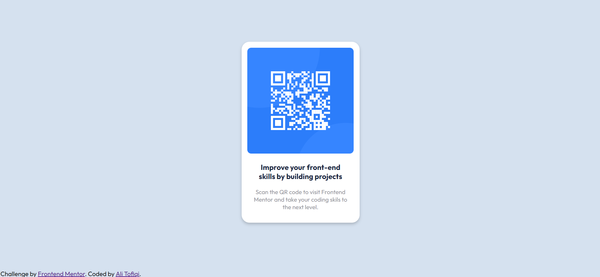

# Frontend Mentor - QR code component solution by Ali Tofiqi

This is a solution to the [QR code component challenge on Frontend Mentor](https://www.frontendmentor.io/challenges/qr-code-component-iux_sIO_H). Frontend Mentor challenges help you improve your coding skills by building realistic projects. 

## Table of contents

- [Screenshot](#screenshot)
- [Links](#links)
- [Built with](#built-with)
- [Useful resources](#useful-resources)
- [Author](#author)
### Screenshot

### Links

- Live Site URL: [GitHub pages](ali-tofiqi.github.io/frontendmentor-QRcode/)

### Built with

- HTML5 markup
- CSS 
- Flexbox

### Useful resources

[W3Schools HowTo](https://www.w3schools.com/howto/default.asp) - This website make it easy to create a card

## Author
- Frontend Mentor - [@Ali-Tofiqi](https://www.frontendmentor.io/profile/Ali-Tofiqi)
- Twitter - [@Ali_Tofiqi](https://twitter.com/Ali_Tofiqi)

